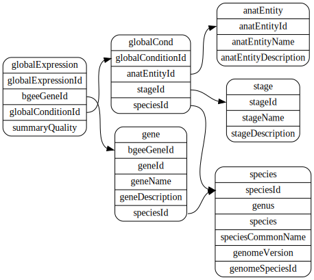
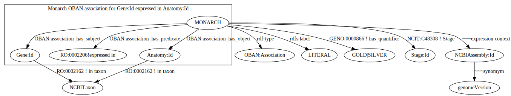

2019 Nov

----------------------------------
```
# existing

time python dipper-etl.py -s bgee

...

INFO:__main__:***** Finished with bgee *****
INFO:__main__:All done.

real	120m17.456s
user	119m29.924s
sys	0m27.303s
```

Two Hours to generate 4,377,842 monarch associations

------------------------------------

There is interest in changing our bgee associations represented.  
Key to this may their very involved concept of "rank"
which amounts to multiple levles of "normalizations" of already nebulus numbers.  

I like their triage aproach they call gold, silver & bronze  
which may as well be good, bad and ugly as they  
do not even bother distributing the bronze by default.  


Download files described here  
    https://bgee.org/?page=doc&action=call_files

------------------------------------------------------------
in `./data/` because I don't like huge data files in git   

```
curl -O data/sql_lite_dump.tar.gz ftp://ftp.bgee.org/current/sql_lite_dump.tar.gz
tar -xf sql_lite_dump.tar.gz
```

Despite the name it is a Mariadb db dump not a sqlite3 db (rats)  

convert it  
```
../../../scripts/mysql2sqlite sql_lite_dump.sql  > bgee_sqlite3.sql

sqlite3 bgee.sqlite < bgee_sqlite3.sql
```

Takes about 15 minutes to reconsitute the database from the sql dump

```
sqlite3 bgee.sqlite
sqlite> .fullschema
```
save output as `bgee_sqlite3_schema.ddl`

then  
```
~/GitHub/SQLiteViz/sqlite_dot.awk bgee_sqlite3_schema.ddl > bgee_sqlite3_schema.gv

dot -T svg  bgee_sqlite3_schema.gv > bgee_sqlite3_schema.svg
```
and we have a handy dandy ER diagram  


```
dot -T plain-ext  bgee_sqlite3_schema.gv |
    awk -F"^graph |^node |^edge |^stop" '/^node / {gsub("\\\n","");split($0,a," ");print a[2];for(i=3;i<length(a);i++)if(match(a[i],"<"))print "\t" substr(a[i],2,length(a[i])-2)}'
```

and a handy plain text list to grab tables & fields from  

```
anatEntity
	anatEntityId
	anatEntityName
	anatEntityDescription

gene
	bgeeGeneId
	geneId
	geneName
	geneDescription
	speciesId

species
	speciesId
	genus
	species
	speciesCommonName
	genomeVersion
    genomeSpeciesId

globalCond
	globalConditionId
	anatEntityId
	stageId
	speciesId

stage
	stageId
	stageName
	stageDescription

globalExpression
	globalExpressionId
	bgeeGeneId
	globalConditionId
	summaryQuality

```

locally I might run `xdot bgee_sqlite3_schema.gv` instead of the sgv.

-------------------------------------------------------------

build up a local tt of their `genomeVersion` to `NCBIAssembly:id`

[bgee.yaml](../../translationtable/bgee.yaml)

-------------------------------------------------------------

```
# to get a list of taxon to filter for in a sql query

cut  -f 3 -d ':' translationtable/bgee.yaml | grep "^[0-9]\{3,\}"
6239|nematode
7227|fruit fly
7955|zebrafish
8364|western clawed frog
9031|chicken
9258|platypus
9365|hedgehog not found.  eriEur2 -> GCA 000296755.1
9593|gorilla
959[78]|bonobo/chimpanzee
9606|human
9615|dog
9685|cat
9796|horse
9823|pig
9913|cattle    ???
9986|rabbit
10090|mouse
10116|rat
10141|guinea pig
13616|opossum   note
28377|green anole
9544|macaque
```

reformat & edit
```
cut  -f 3 -d ':' translationtable/bgee.yaml |
    grep "^[0-9]\{3,\}" | sed "s~\([^|]*\)|.*~'\1',~;" | tr -d '\n'

'6239','7227','7955','8364','9031','9258','9365','9593',
'9597','9598','9606','9615','9685','9796','9823','9913',
'9986','10090','10116','10141','13616','28377','9544'
```

----------------------------------------------

in the db selecting for   
    speciesID, geneId, anatEntityId, summaryQuality, stageId, genomeVersion
e.g
    6239|WBGene00002059|UBERON:0000465|GOLD|UBERON:0000107|WBcel235

```
sqlite> .read ../select_query.sql
32,589,067
Run Time: real 181.538 user 72.464747 sys 58.335826
```
Puts together _ALL_ 32M records (monarch associations) in three minutes

---------------------------------------------------
```
sqlite> .read ../select_query.sql
9,825,168
Run Time: real 70.235 user 41.318082 sys 28.917016
```
Puts together 10M _GOLD_ level records in seventy seconds

---------------------------------------------------------


Start a SWAG of a data model  





There is a request to provide some feedback on how specific a gene 
is to an anatomical structure in a species.

At ingest is not the place to answer this question at all levles of 
granularity a user may intend. But it is we we can ensure the base information 
is availabe and provide guidance to reasoners in the form of counts of both 
genes and anatomy per species. 
(which will on occasion be exactly the granularity desired)  

A ficional example of where simple counts fall down is 
`brain` may have a count of `one` gene expressed   
but if `midbrain` and `hindbrain` each have acount of `5` genes expressed 
the `one` for `brain` may be seen as misleading,sr there are now `5 to 11`
genes in play.  
or maybe not...as it may be the only gene that lights up in both parts      

At any rate generating the gene `density` of a tissue  
and the `specificity` of a gene to an anatomical term  
for all the species only takes several moments.

N.B.  I am currently limiting all queries to __GOLD__ level
------------------------------------------------------------


